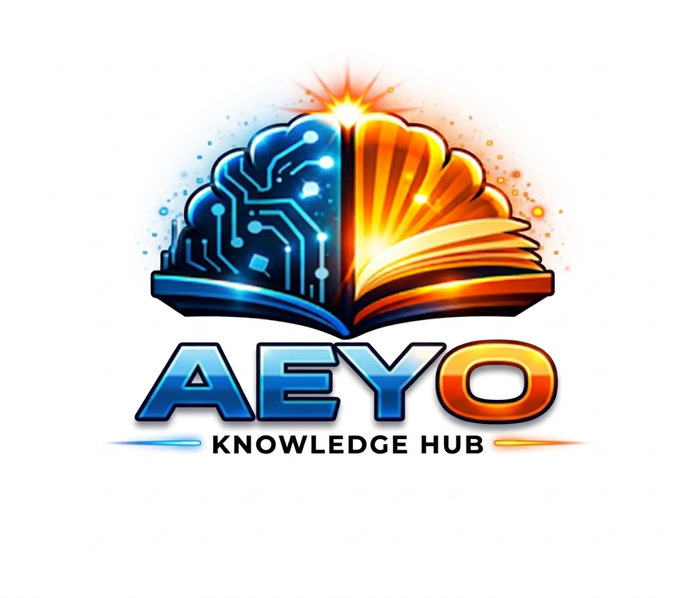

# AEYO-KNOWLEDGE-HUB
Software que permite organizar y registrar los movimientos de préstamos de libros en una biblioteca. Este dará acceso a la información con mayor facilidad y rapidez y ayudará con la automatización de los procesos permitiendo una interacción entre usuario y sistema, creando una gestión estructurada de los datos.
## INTEGRANTES:
### Estefany Paola Arenilla Morro 
### Orleyder Cabrera Palacios
### Yeison Cortés Villada
### Anderson Restrepo Monsalve
## VÍNCULOS ACADÉMICOS Y DESCRIPCIÓN
Yeison Cortes Villada, estudiante de ingeniería industrial, 4to semestre, habilidades en liderazgo, generar estrategias y optimización de procesos. Como fortalezas, proactivo, empático, adaptado a los cambios. En el software aportaré el registro y gestión de libros y ayudare con las restricciones para los préstamos de libros al momento de alguien realizar la solicitud. 

Orleyder Cabrera Palacios, estudiante de séptimo semestre de ingeniería industrial. Poseo habilidades gerenciales, derivado de las responsabilidades concerniente al desempeño de mi trabajo, me caracterizo por liderar procesos que conlleven a la obtención de las metas trazadas. En el software aportaré el registro y gestión de usuarios.

Anderson Restrepo Monsalve, estudiante de Ingeniería Industrial de quinto semestre, con experiencia laboral en laboratorio. Me caracterizo por ser una persona responsable, social y comprometida, con habilidades de liderazgo, comunicación y trabajo en equipo. Destaco por mi disposición para aprender, escuchar y aportar ideas que contribuyan al mejoramiento continuo. En el software aportaré los réstamos y devoluciones.

Estefany Paola Arenilla Morro, soy estudiante de tercer semestre de ingeniería industrial, me caracterizo por mi disciplina, responsabilidad y compromiso en el desarrollo de las actividades académicas. Poseo habilidades de liderazgo, una actitud tolerante y una excelente disposición para el trabajo en equipo, lo que me permite integrarme de manera efectiva en entornos colaborativos. Me destaco por mi capacidad de adaptación al cambio, lo cual me facilita enfrentar nuevos retos y ajustarme de manera eficiente. Aportaré al desarrollo del proyecto una entrega constante, responsabilidad en el cumplimiento de tareas y total disposición para colaborar, apoyar a mis compañeros y contribuir al logro de los resultados propuestos. En el software aportaré la integración, interfaz y documentación.
## NOMBRE DEL PROYECTO Y DETALLES

## DESCRIPCIÓN GENERAL DEL SOFTWARE AEYO KNOWLEDGE HUB
Es un software desarrollado en Python para la gestión de préstamos de libros en una biblioteca. Su propósito es organizar y registrar de manera estructurada la información relacionada con los libros, los usuarios y los movimientos de préstamo y devolución.
El sistema permitirá automatizar procesos que normalmente se realizan de forma manual, reduciendo tiempos de búsqueda, errores en los registros y dificultades en el control de los libros disponibles. Además, facilitará la interacción entre el usuario y el sistema mediante un menú claro y organizado, permitiendo acceder a la información de manera rápida y eficiente.
Este software estará orientado a bibliotecas académicas o institucionales, ofreciendo una herramienta sencilla para administrar el inventario de libros y el historial de préstamos.
## OBJETIVOS DEL SOFTWARE
### Objetivo general
Desarrollar un sistema que permita gestionar de manera eficiente los préstamos y devoluciones de libros en una biblioteca, optimizando el control de la información y automatizando los procesos.
### Objetivos específicos
1.	Registrar y almacenar la información de los libros disponibles en la biblioteca.
2.	Registrar los datos de los usuarios autorizados para realizar préstamos.
3.	Crear un registro y control de préstamos y devoluciones de los ítems disponibles en el sistema.
4.	Consultar el estado de disponibilidad de los libros.
5.	Generar un historial de movimientos de préstamo.
## BENEFICIOS DEL SOFTWARE
1.	Disminuye el tiempo necesario para registrar préstamos y devoluciones.
2.	Facilita la búsqueda de libros y usuarios.
3.	Mejora la organización de la biblioteca.
4.	Permite conocer en tiempo real cuáles libros están disponibles y cuáles se encuentran prestados.
5.	Reduce errores humanos en el registro manual de la información.
6.	Proporciona un historial de movimientos que facilita el seguimiento de los préstamos.
7.	Favorece la toma de decisiones y la administración de los recursos bibliográficos.
## REQUISITOS FUNCIONALES
1.	El usuario registra usuarios validando nombre, apellido, documento, correo electrónico y tiempo de préstamo.
2.	El administrador registra ítems mediante categorías, estados, precio y generación automática de identificadores únicos.
3.	El sistema valida los códigos de categorías y estados ingresados por el administrador.
4.	El usuario registra préstamos únicamente si se encuentra previamente registrado en el sistema.
5.	El sistema verifica la disponibilidad de los ítems antes de realizar un préstamo.
6.	El sistema registra automáticamente la fecha y hora de cada préstamo realizado.
7.	El sistema controla el estado de los préstamos mediante los estados ACTIVO y DEVUELTO.
8.	El usuario registra devoluciones únicamente cuando existen préstamos activos asociados al usuario y al ítem.
9.	El sistema genera automáticamente certificados de devolución en formato TXT.
10.	El sistema genera facturas automáticas cuando el tiempo de préstamo excede el límite permitido.
11.	El sistema calcula automáticamente impuestos y valor total en las facturas generadas.
12.	El administrador exporta la información almacenada en archivos TXT hacia archivos CSV compatibles con Excel.
13.	El administrador accede a funciones administrativas mediante autenticación de usuario y contraseña.
14.	El administrador visualiza estadísticas básicas del sistema, como total de usuarios y préstamos registrados.
15.	El sistema almacena permanentemente la información en archivos planos TXT.
16.	El sistema valida errores de entrada para evitar registros inválidos o duplicados.
17.	El administrador consulta el historial de préstamos y devoluciones para fines estadísticos y de control.
## REQUISITOS NO FUNCIONALES
El sistema debe cumplir con:
1.	Usabilidad: interfaz de consola clara, sencilla e intuitiva. 
2.	Rendimiento: respuesta rápida en operaciones básicas. 
3.	Seguridad: validación de acceso al módulo administrador. 
4.	Fiabilidad: manejo correcto de errores y validaciones. 
5.	Persistencia: almacenamiento en archivos planos. 
6.	Compatibilidad: ejecución en cualquier entorno que soporte Python. 
7.	Mantenibilidad: código estructurado con clases y buenas prácticas. 
## PLAN DE PROYECTO
### Presupuesto

### Diagrama de Gantt																						

[Descargar diagrama de Gantt y presupuesto en Excel](Entregables/diagramaYpresupuestoAEYO.xlsx)

[Actas](Entregables/ACTAS.pdf)

Esta obra está bajo la licencia <a href="https://creativecommons.org/licenses/by-sa/4.0/">Creative Commons Atribución-CompartirIgual 4.0 Internacional.</a>

<a href="http://aeyo.com">AEYO</a> © 2026 by <a href="http://aeyo.com">Yeison Cortes</a> is licensed under <a href="https://creativecommons.org/licenses/by-sa/4.0/">CC BY-SA 4.0</a>
